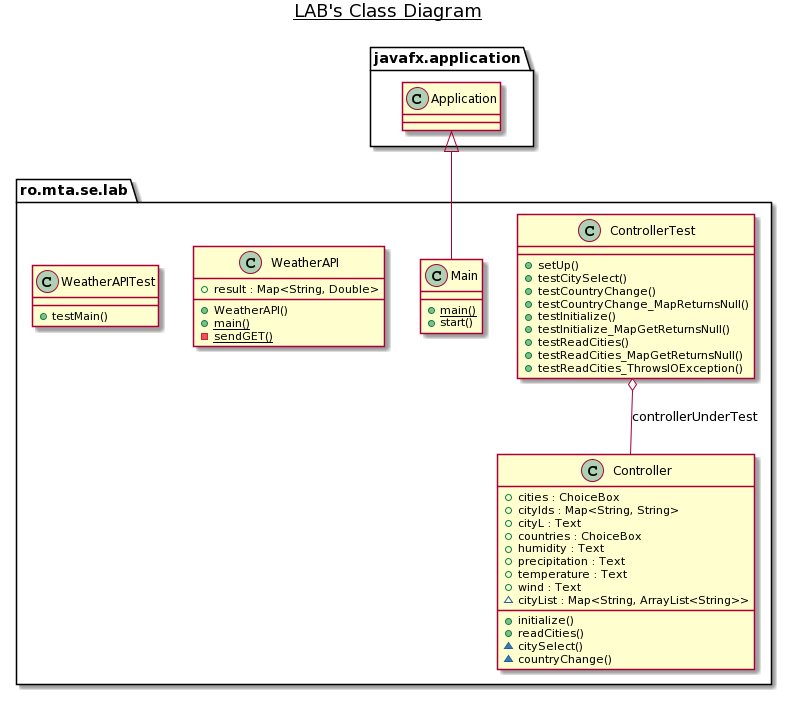
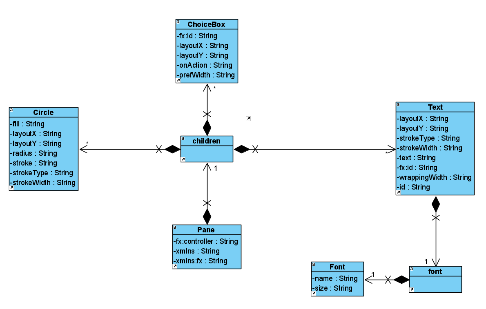

# Manea Sebastian C114D

# Context

In repository-ul prezent, avem implementata o aplicatie care determina vremea dintr-o lista de tari, respectiv orase cu multiple functionalitati auxiliare.

# Tehnologii folosite

Limbajul in care a fost realizata aplicatia este Java, cu SDK-ul corretto-1.8 pentru JavaFX. Pentru testare a fost folosita biblioteca mockito, iar pentru preluarea datelor OpenWeatherMapAPI.

## Structura aplicatiei

In aplicatie putem regasi 3 clase principale :

**Main.java**
De aici doar se incarca resursele si se pregateste scena.

**Controller.java**
Realizeaza legatura intre aplicatie si scena. De asemenea, din aceasta clasa citim si lista de orase/tari, parsam linie cu linie, folosim regex-ul W+ pentru a imparti linia in cuvinte si urmarim esentialele ID-ul si numele orasului, respectiv tara. Avem 2 metode specifice FXML: citySelect() si countryChange(), care determina cand avem o selectie completa a unui oras pentru a interoga vremea.

**WeatherAPI.java**
Folosim 2 URL-uri, primul interogat determina sansa de ploaie, iar al doilea restul datelor, deoarece o interogare simpla nu va determina sansa precipitatiilor. Stocam in hashmap-ul "result" datele necesare pentru afisare dupa ce le extragem din JSON-uri.

**Scheletul FXML**
Aici se gaseste structura interfetei aplicatiei.

**Fisiere auxiliare**:
history : istoricul raspunsurilor in format JSON
list : lista intrarilor
WeatherAPITest, ControllerTest : clasele pentru testele unitare

## Workflow
Se incarca lista de orase si tari in fisierul list, se alege optiunea si aplicatia va interoga API-ul pentru a extrage datele necesare, pe urma acestea vor fi salvate in fisierul history.

## Diagrame UML

